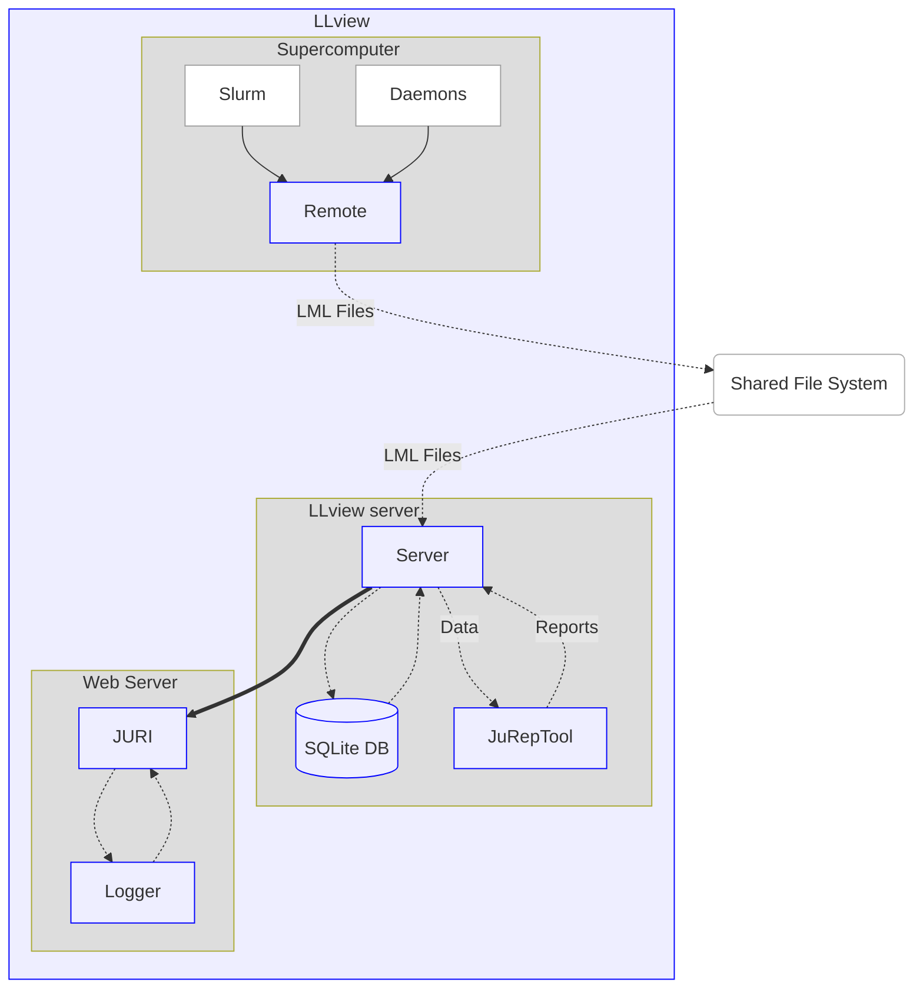

# Description

This document gives a comprehensive overview of how LLview works, including its different modules.

The functioning of LLview is based on crontab jobs that periodically runs Perl scripts. The idea of this document is to list and describe all the steps, from the initial cronjob, to the innermost scripts.

LLview can separated into a few parts parts:

* **LLview**: The main module of LLview, that collects the data, process it, stores in a database, and generate data for other modules. (Perl, SQLite, YAML) It can be separated into two parts:
    * [Remote](remote): this part runs on the system that will be monitored (a.k.a., the remote system), and uses some scripts and adapters to collect the desired metrics that are only available directly on the system (i.e., information from the Scheduler). The metrics are then written into [LML Files](#lml-files) in a shared folder.
    * [Server](server): in a separate server (a.k.a., the LLview server), the metrics are put into an SQLite database, processed and output to a web-server.
* **[JuRepTool](jureptool)**: Module responsible to generate HTML and PDF reports for all jobs. (Python)
* **[JURI](juri)**: Module responsible to create the web portal using the data provided by the LLview server. (Javascript/HTML/CSS)
* **[Logger](logger)**: Small module to collect access information from the LLview and JURI/Apache logs. (Python)

# Folders

Important folders that will be used throughout this documentation:

* `${LLVIEW_HOME}`: location where LLview is installed (i.e., `${HOME}/llview`)
* `${LLVIEW_DATA}`: folder where the files generated by LLview (data, logs, errors, etc.) will be located (i.e., `${HOME}/.data`)
* `${LLVIEW_CONF}`: configuration folder where all the configuration is done (i.e., `${LLVIEW_DATA}/config`)
* `${LLVIEW_SHARED}`: shared folder between the remote system and the LLview server. This can include the system name and the username of a special user that has access to all jobs/metrics on the remote system (e.g.: `/p/hpcmon/<system>/llstat`)

# LML files

These files are based on XML format, and includes first a list of the objects it contains, and then blocks with the detailed information of each one.

