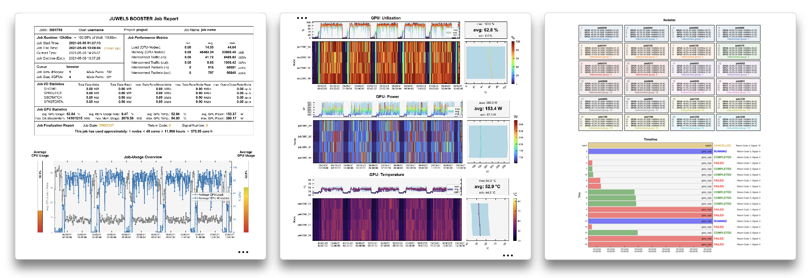
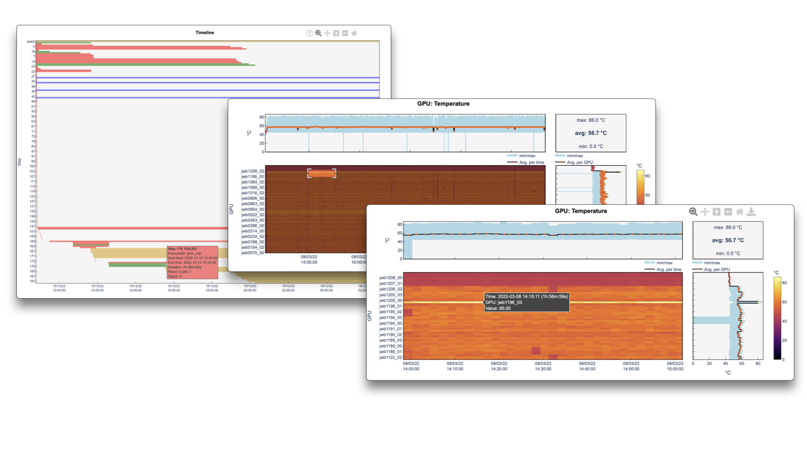

---
hide:
  - toc
---
# Detailed Reports

<figure markdown>
  { width="800" }
  <figcaption>Example of metrics and graphs in PDF report</figcaption>
</figure>

LLview automatically generates detailed reports for all jobs that run for more than ~2-5 min (depending on the number of jobs running on the system).
They are available in the two rightmost columns of the Job Reporting list of jobs.
These reports contain an initial general report with basic details of the job, and an overview of the average CPU (and GPU) run per time.
Afterwards, the report includes a number of visual graphs with all the [collected metrics](metrics_list.md) for CPUs, GPUs, file systems and interconnect,
each of them consisting of

  * A colorplot with `time` x (`nodes` or `gpus`) x `metric`;
  * Above it, the node-average per timestamp, as well as the min. and max. values;
  * On the right side, the time-average per node values, with the min.-max. range;
  * Global average, minimum and maximum values on the top-right (or the meaning of the values).

The plots may help users and administrators to identify [behaviours, problems and bottlenecks](examples.md) on the different jobs.
The list of nodes, color-coded with their interconnect cells, are also listed on the reports.
When system errors occur, they are also collected and shown at the bottom of the reports.

!!! tip

    The job reports accept options using the Slurm `--comment` field. Currently, the option below is available:

    * `llview_plot_lines`: In the PDF report, use line plots for each node/GPU instead of colorplots (only for jobs running on less than 16 nodes or GPUs).

<figure markdown>
  { width="800" }
  <figcaption>Example of interactive graphs in detailed reports</figcaption>
</figure>

On the interactive web-based report (accessible via the :fontawesome-solid-chart-area: link), the graphs display information on the points when hovering over them with the mouse pointer. 
They may be also be zoomed and shifted by clicking and dragging on a given region of the graph, or directly moving the the axes.
The range of the graphs for each section may be "locked" together via the *zoom-lock* toogle on the information bar at the bottom.
Finally, the data for each graph may also be downloaded in the JSON format (via the Download button on the top-right corner of the respective graph).
