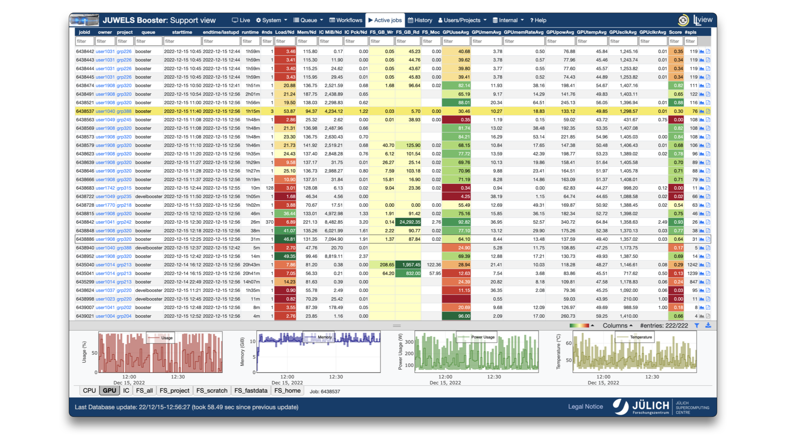

---
hide:
  - toc
---
# List of Jobs

<figure markdown>
  { width="800" }
  <figcaption>List of active jobs in LLview</figcaption>
</figure>

The job reporting interface of LLview web portal displays a list of the currently running jobs, which is updated every 1-3 minutes.
The list of jobs are separated in tabs:

* `Active jobs`: Jobs that are still running;
* `Jobs < 3 weeks`/`History` (depending on the user's role): Jobs that finished up to 3 weeks before.

!!! note

    Jobs that run for less than ~2min *may* not show up in the Job Reports, as there may be insufficient data.

Each job on the list contains: 

* Basic information (as job ID, username, project, start and estimated end time, etc.)
* Collected and derived/aggregated metrics for different quantities (some of them color-coded to indicate good or bad values)
* Number of errors
* Links to the [detailed interactive report and to the PDF download](detailed_reports.md)
* Color-coded score for the jobs

!!! note

    The score is based on simple data at the moment, but might get more sophisticated in future iterations. The score for CPU-only jobs takes into account solely the `CPU usage` metric. For GPU jobs, additionally the `GPU average usage` metric is used. In that case, the score of the job is calculated mostly using the `GPU average usage` metric (97%), with an addition of the `CPU usage` (3%)[^cpu-gpu-distribution].

    !!! example

        * A CPU-only job using half of the available cores through the entirety of the job has a score of 0.5
        * A GPU-enabled job using 3 of the 4 installed GPUs, driven by 3 cores, has a score of $\frac{3}{4}\cdot 0.97 + \frac{3}{48}\cdot 0.03 = 0.73$, assuming all devices are busy throughout the entire job 
    
    [^cpu-gpu-distribution]: The 97:3 relationship is an attempt to also incorporate the hosting cores of GPU-only jobs within the score. It is inspired by the performance distribution within a JUWELS Booster node for double-precision computation. The installed NVIDIA A100 GPUs provide roughly 97% of the performance of a node (19.5 TFLOP/s per GPU, 4 GPUs per node), while the AMD EPYC Rome CPUs contribute with approximately 3% (16 FP64 operations per cycle per core, 3.35 GHz, 24 cores per socket, 2 sockets per node).

The job list can be filtered and sorted by different quantities, and the visibility of different column sections can be chosen on the bottom right of the list.
Moreover, when a job is selected, graphs for key performance metrics are shown at the bottom of the screen, with average, minimum and maximum time series.
Their sizes may be adjusted via the buttons on the gray bar above them.
The information about the jobs as well as the interactive and PDF reports are stored for three weeks.
Afterwards, the information is archived and not accessible by the user anymore.

<!-- .. Example of information and graphics present in these reports are shown in the Figure.
.. The visual display helps users and administrators to identify behaviours, problems and bottlenecks on the different jobs.
.. On the detailed HTML report, the graphs display information on the points when hovering the mouse pointer. 
.. They may be zoomed and shifted, and data for each graph may also be downloaded in the JSON format.
.. The plots presented on these reports are configurable via YAML files, and some options are given to the user via the Slurm argument \texttt{-{}-comment}.

.. toctree::
    :maxdepth: 2

    detailed_reports
    metrics_list
    examples
 -->
