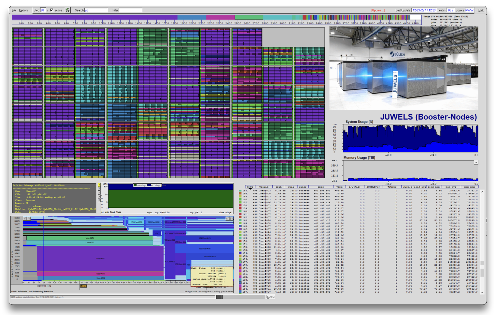

---
hide:
  - toc
---
# LLview Client

<figure markdown>
  { width="800" }
  <figcaption>LLview Client interface with node map, running jobs and system usage</figcaption>
</figure>

The interactive client is a stand-alone application that can run on any Linux/Windows/MacOS system and shows the current state of the monitored system. 
It includes a color-coded list of the running jobs and their distribution along with the racks and nodes, as well as a visual representation of the queue state. 
The job list and the system distribution are linked together, and the identification can be seen by hovering the mouse pointer over one of them. 
Monitoring data is accessed by HTTPS from LLview web server providing LML files (more details about this data format below). 
Currently, the batch mode of the client is used to generate SVG files representing a live view of the system, which is then embedded into the job reporting web portal via the [Live](index.md) tab.

