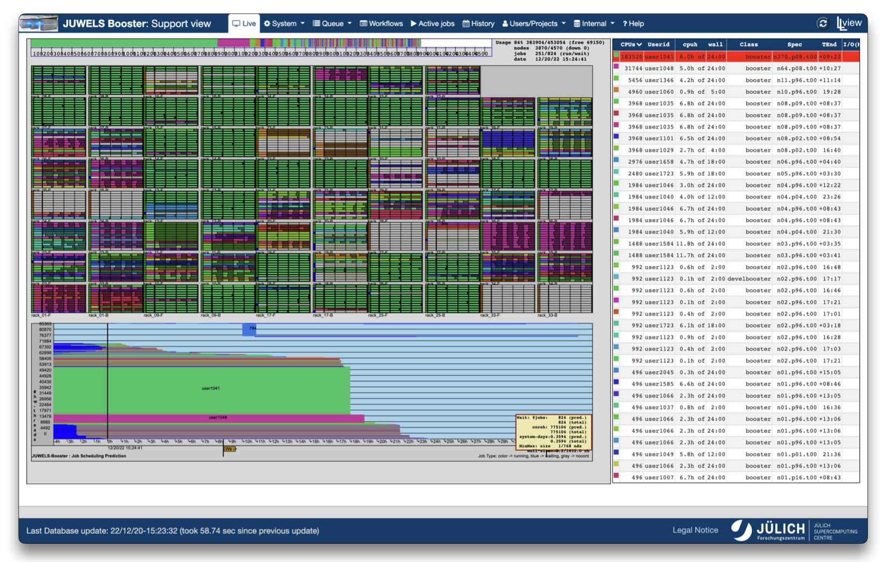

---
hide:
  - toc
---
# Live View

<figure markdown>
  { width="800" }
  <figcaption>LLview Client interface with node map, running jobs and queue</figcaption>
</figure>

The `Live` tab, as the [LLview Client](client.md), displays dynamic and interactive view of the system, including:

* Stack diagram of jobs ordered by size;
* A map of the racks and nodes;
* List of jobs;
* Queue diagram (with running jobs and predicted ones);

Each of these elements can be hovered and their counter parts in the others will be highlighted. 
This view is useful to see how a given job is distributed over the system (and conversely to identify a given job from its distribution), how long it is predicted to run, when the next jobs are predicted to run, and also how is current usage of the system.
