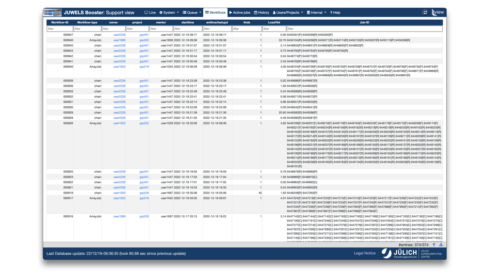

---
hide:
  - navigation
  - toc
---
# Workflows

<figure markdown>
  { width="800" }
  <figcaption>List of workflows in LLview</figcaption>
</figure>

LLview now recognizes workflow of jobs (e.g., SLURM arrays and dependency-chains), and show them in the `Workflows` tab. 
The information available per workflow are:

* **WorkflowID**: Unique ID of the workflow;
* **Type**: Type of workflow (currently SLURM arrays and chains);
* **Owner**: Username of the user owner of the workflow;
* **Project**: Budget used for job submission (project ID);
* **Mentor**: Mentor of the project;
* **Start Date**: Start date and time of first job in workflow;
* **Last Update**: Date of last update from scheduler or end time of last job of workflow;
* **\#Nodes**: Average number of nodes used by the jobs in the workflow;
* **CPU Load**: CPU load, 1-min average among all jobs, nodes and over time;
* **JobID List**: List of job IDs in the workflow, and their state (`P`: Pending; `R`: Running; `C`: Complete; `F`: Failed)
